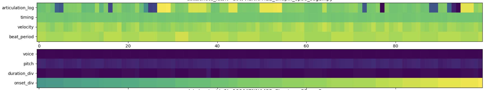

- __Wandb__: https://wandb.ai/huanz/DiffPerformer

# Table of Content
- [Table of Content](#table-of-content)
- [Installation](#installation)
- [Dataset and Data processing](#dataset-and-data-processing)
  - [Testing set](#testing-set)
- [Training](#training)
  - [Supervised training with conditioning](#supervised-training-with-conditioning)
- [Testing](#testing)


# Installation
This repo is developed using `python==3.9.7`, so it is recommended to use `python>=3.9.7`.

To install all dependencies
```
pip install -r requirements.txt
```

# Dataset and Data processing

Three score-performance aligned datasets are used in this project:
* ATEPP: https://github.com/BetsyTang/ATEPP 
  * The above link doesn't contain score-performance aligned match file. Download dataset with [parangonar](https://github.com/sildater/parangonar) alignment computed: https://drive.google.com/file/d/1YsZC_uvaOomIUW0RxqkB_8DNFQlkVl-A/
* ASAP: https://github.com/CPJKU/asap-dataset 
* VIENNA422: https://github.com/CPJKU/vienna4x22 

The following script converts the scores and performances in the datasets into performance codec ```p_codec``` and score codec ```s_codec```. Output will be saved in ```data/```. Notice that different ```MAX_NOTE_SEQ``` will lead to different truncation of ```snote_ids``` and saved separately. 

```
python prepare_data.py --MAX_NOTE_SEQ=100
```
- ```MAX_NOTE_LEN```: The length of note sequence to split.

For pre-computed codec, please [download](https://drive.google.com/file/d/1o91jYxOMsbXZZvfE7Z_8hM6DJbXixoXb/view?usp=sharing) and unzip. It contains the codec and snote_ids of ```MAX_NOTE_LEN=100, 300, 1000```. 

Before training, put the pre-computed codec in ```data``` under the root folder. However, for testing and output decoded performance, you will need the originl score XML from the 3 datasets. Please download them and put them under ```Dataset``` in the same level as root folder (we need the score to decode performance). 



## Testing set


# Training

## Supervised training with conditioning
```
python train.py gpus=[0] task.timestep=1000
```

- `gpus` sets which GPU to use. `gpus=[k]` means `device='cuda:k'`, `gpus=2` means [DistributedDataParallel](https://pytorch.org/docs/stable/generated/torch.nn.parallel.DistributedDataParallel.html) (DDP) is used with two GPUs.
- `timesteps` set the number of denoising timesteps.
- For a full list of parameters please refer to `train.yaml` and `task/classifierfree_diffusion.yaml`

The checkpoints will be output to `artifacts/checkpoint/`

To check the progress, please go to the wandb page. 


# Testing
The training script above already includes the testing. (testing is run every 100 epochs of training.)

First, open `config/train.yaml`, and then specify the weight to use in `pretrained_path`, for example `pretrained_path='artifacts/checkpoint/len300-beta0.02-steps1500-x_0-L15-C512-cfdg_ddpm_x0-w=0-p=0.1-k=3-dia=2-4/1244e-diffusion_loss0.03.ckpt'`. Or you can specify in the command line.

<!-- You can download pretrained weights from [Zenodo](https://zenodo.org/record/7246522#.Y2tXoi0RphE). After downloading, put them inside the folder `weights`. -->

```
python train.py gpus=[0] --test_only=True --load_pretrained=True
```

During testing, the following will be generated / evaluated: 
- Sampling the testing set data.
- Render the samples (first 8 is the subjective test set). Output into `artifacts/samples/`
- Animation of the predicted p_codec from noise
- Tempo curve and velocity curve. If `WANDB_DISALBED=False` this will be uploaded to the wandb workspace. 
- Comparison between the pred p_codec and label p_codec.
